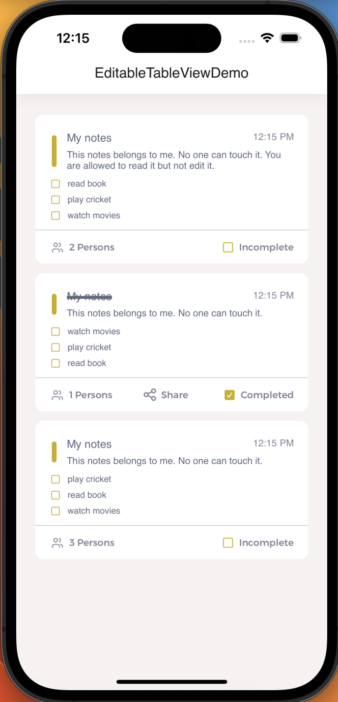
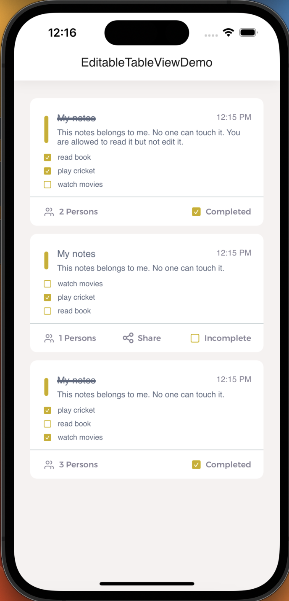

# EditableTableViewDemo App

Welcome to the EditableTableViewDemo App, an iOS application that shows the implementation of complex table view design with an other table view within that cell. It also supports deleting cell with a checkbox. It also allow you to mark it complext which strikes through the title of cell. You can also marks tasks complete in nested cells. This README file provides an overview of the app, its features, and the skills showcased in its development.

## Screenshots

  
  

## MVC Architecture

The **EditableTableViewDemo App**: follows the Model-View-ViewModel (MVVM) architectural pattern, which promotes separation of concerns and makes the codebase more modular and testable.

## UIKit Framework

The **EditableTableViewDemo App** is built using Apple's UIKit framework, which provides a comprehensive set of tools for building user interfaces across all Apple platforms.

## Table View

Table View is employed in the project to present structured data in a tabular format with rows and sections. It offers a standardized way to organize and display information, making it suitable for lists of contacts, messages, and more.

## XIBs

The project leverages XIB files for interface design. XIBs allow for creating individual interface components or views, supporting a modular approach to UI design. By utilizing XIBs, the project maintains a separation of concerns and enhances the reusability of UI elements.

## Requirements

- iOS 13.0+
- Xcode 13.0+
- Swift 5.5+

## How to Run

1. Clone the repository or download the ZIP file.
2. Open the `EditableTableViewDemo.xcodeproj` file in Xcode.
3. Choose the desired simulator or a connected iOS device.
4. Press the "Run" button (or use the shortcut `Cmd + R`) to build and run the app.

## Contributing

Contributions to the EditableTableViewDemo App are welcome! If you find any bugs, have feature suggestions, or want to contribute improvements, please feel free to open a pull request.

## Credits

The EditableTableViewDemo App is developed by **Sham Kumar**. If you have any questions or need assistance, you can reach out to me at ksham1999@gmail.com.

## License

The EditableTableViewDemo App is released under the [MIT License](LICENSE). You are free to use, modify, and distribute the app as per the terms of the license.
